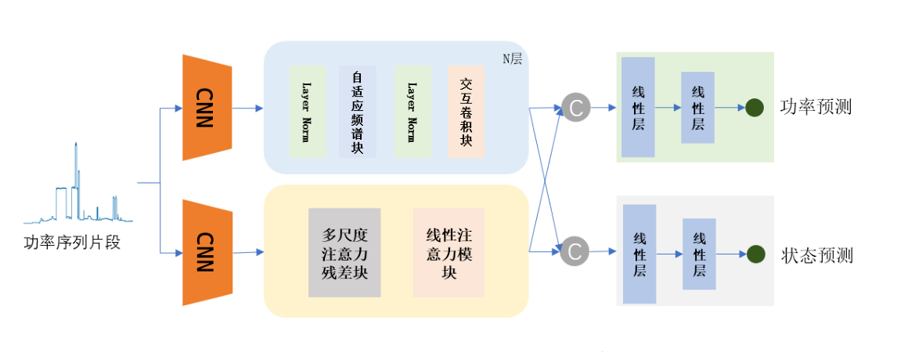
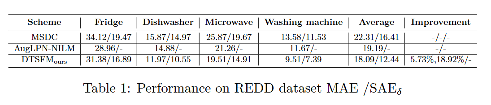

# DSTFM

### Model Architecture

### Evaluation Metrics

*   MAE (Mean Absolute Error)
*   SAEδ (Watt)

### Results

* TODO

UPDATE Performenace on UK_DALE dataset

### Reference Links

*   **MSDC (AAAI, 2023):** [https://github.com/sub-paper/MSDC-NILM](https://github.com/sub-paper/MSDC-NILM) [1]
    *   Paper: MSDC: Exploiting Multi-State Power Consumption in Non-intrusive Load Monitoring based on A Dual-CNN
*   **AugLPN-NILM (SCI二区, 2024):** [https://github.com/linfengYang/AugLPN_NILM](https://github.com/linfengYang/AugLPN_NILM) [2]
    *   Paper: AugLPN-NILM: Augmented Lightweight Parallel Network for NILM Embedding Attention Module over Sequence to Point
